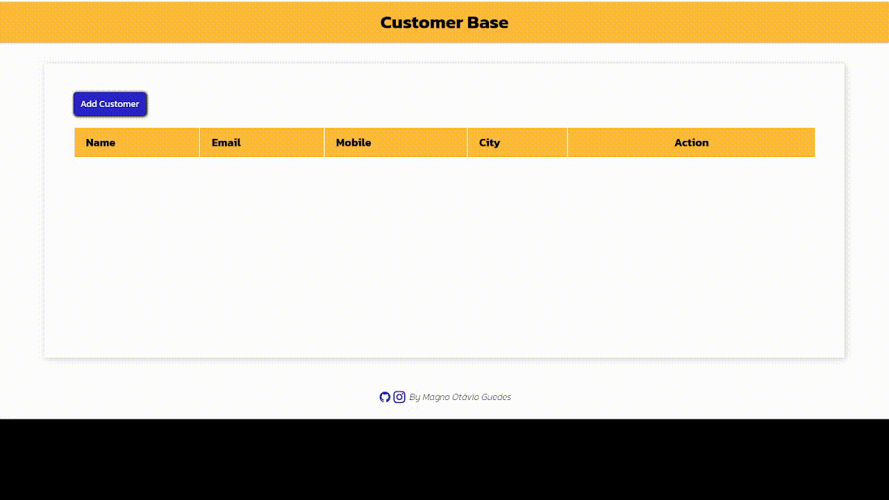

# Pure JavaScript CRUD using localStorage 💻

### 🎯 Menu

Click to Expand

◽ <a href="#start">Start</a>  
◽ <a href="#requirement">Requirement</a>  
◽ <a href="#access-project">Access Project</a>  
◽ <a href="#techstack">Tech Stack</a>  
◽ <a href="#about">About</a>  
◽ <a href="#preview">Preview</a>  
◽ <a href="#status">Project Status</a>  
◽ <a href="#author">Author</a>  

<h3 id="start">🚀 Start</h3>

[Start Crud](https://moguedes.github.io/CRUD-JavaScript/)

<h3 id="Requirement">📋 Requirement</h3>

<h3 id="access-project">📁 Acessar Projeto</h3>

◽ <a href="https://github.com/brseghese/progbr-jogo-da-memoria/tree/main">Acessar</a>🔗 o código fonte pelo GitHub.  
◽ <a href="https://github.com/brseghese/progbr-jogo-da-memoria/archive/refs/heads/main.zip">Download</a>🔗 do código fonte no formato zip. 
◽ Clonar o repositório ultilizando Git Bash + o comando:

       $ git clone colocar link

<h3 id="techstack">⚙️ Tech Stack</h3>

  
  
  

<h3 id="about">📍 About</h3>

✅ It was designed as a CRUD to manipulate a fictional company's customers' information.  
✅ All data is stored in localStorage.  
✅ There are buttons to edit and delete the data stored.   

<h3 id="preview">🎥 Preview</h3>

<h3 id="status">📌 Project Status</h3>

Testing... 🚧

<h3 id="author">✒️ Author</h3>

Developed by **Magno Guedes**.

 
